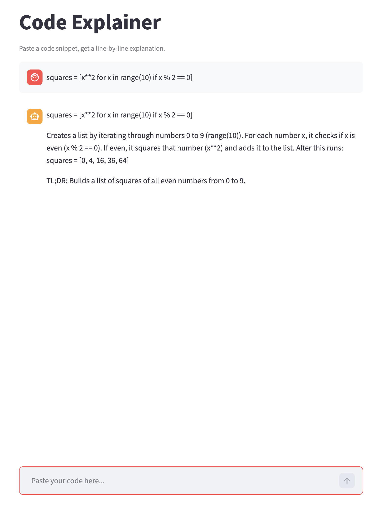

# Code Explainer

Streamlit + Claude chatbot for explaining Python code. Multi-turn conversation with few-shot and structured output patterns.

---

## Live demo

Base URL: `https://app-chat-demo.streamlit.app/`

> **Note on cold starts:** The free tier sleeps after 1 hour 
> of inactivity. First request after idle takes 30–60 seconds. 
> Subsequent requests respond in 2–6 seconds.
---

## What it does

- Multi-turn conversation with Claude
- Few-shot prompting for consistent formatting
- Structured output with TL;DR summaries
- Session state for conversation persistence
- Error handling for API failures

---

## Requirements

- Python 3.13+
- Git
- An Anthropic API key ([get one here](https://console.anthropic.com))

Dependencies are listed in `requirements.txt`. See [Tech stack](#tech-stack) below.

---

## Local setup

**Clone and enter the project:**

    git clone https://github.com/digitalrower/streamlit-chat-demo.git
    (or)
    git clone git@github.com:digitalrower/streamlit-chat-demo.git

    cd streamlit-chat-demo

**Pin Python version (requires pyenv):**

    pyenv local 3.13.3
    python --version              # should show Python 3.13.3

**Create and activate a virtual environment:**

    python -m venv .venv
    source .venv/bin/activate     # Mac/Linux
    # Windows: .venv\Scripts\activate

**Install dependencies:**

    pip install -r requirements.txt

**Set up environment variables:**

    cp .env.example .env

Open `.env` and replace the placeholder with your actual Anthropic API key:

    ANTHROPIC_API_KEY=your_actual_api_key_here

---

## Quick start

After setup, run:

    streamlit run src/app.py

Server starts at `http://localhost:8501/`

Paste a Python snippet into the chat input:

    squares = [x**2 for x in range(10) if x % 2 == 0]

Press Enter. Claude explains the code line-by-line with a TL;DR.

---

## Implementation highlights

- Few-shot prompting added for consistent output format
- History capped at 20 turns to prevent cost runaway
- Session state replay loop explains how Streamlit reruns work
- Structured output ensures line-by-line + TL;DR format

---

## Limitations

- History cap means conversations (20+ turns) will forget older context
- Code explanations are concise; very long snippets may be truncated
- Streamlit Community Cloud free tier sleeps after 1 hour inactivity

---

## How it works

The app uses **few-shot prompting** to teach Claude a consistent response format through examples rather than instructions alone. The system prompt includes example code explanations, which Claude uses as a template for all subsequent responses.

**Session management:** Streamlit's `st.session_state` persists the conversation history across app reruns. Each user message appends to the history, which is sent to Claude in full on each request (capped at 20 turns to prevent cost runaway and context window overflow).

**Error handling:** API failures (network timeouts, rate limits) are caught and displayed as red banners in the UI, with conversation history rolled back to prevent orphaned user turns.

---

## Project structure

    streamlit-chat-demo/
    ├── src/
    │   └── app.py           # Streamlit UI and LLM Call app
    ├── .env.example         # Environment variable template
    ├── .gitignore
    ├── requirements.txt
    └── README.md

---

## Tech stack

- [Streamlit](https://streamlit.io/) — User Interface
- [Anthropic Python SDK](https://github.com/anthropics/anthropic-sdk-python) — Claude API client
- [python-dotenv](https://github.com/theskumar/python-dotenv) — Environment variable management

---

## Environment variables

| Variable | Required | Description |
|----------|----------|-------------|
| `ANTHROPIC_API_KEY` | Yes | Your Anthropic API key from console.anthropic.com |

See `.env.example` for the template.

---

## License

MIT

